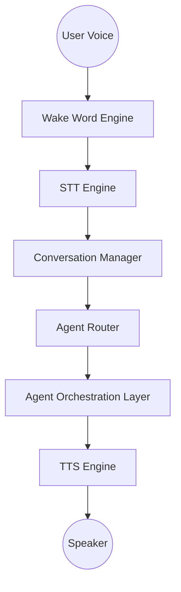

# Voice Assistant Architecture

*This is a planned architecture document for the future JARVIS Voice Assistant module. No implementation currently exists.*

## Core Responsibilities
The Voice Assistant is a dedicated interface modality. It **does not** contain business logic or individual agent capabilities. Instead, it translates human speech into semantic intents, routing them to the Agent Orchestration layer.

## Component Pipeline

1. **Wake Word Detection (Edge)**
   - Runs continuously on the client device.
   - Triggers the active listening state to conserve bandwidth.

2. **Speech-to-Text (STT)**
   - High-fidelity streaming transcription (e.g., Deepgram, Whisper).
   - Real-time chunking to reduce perceived latency.

3. **Conversation Manager**
   - Maintains a sliding window of context ("Voice Memory").
   - Decides if the input is a direct command or conversational chatter.
   - Formulates the exact prompt to send to the **Agent Runtime**.

4. **Agent Router**
   - Dispatches the intent to the correct agent (e.g., "Schedule a meeting" -> Scheduler Agent).

5. **Text-to-Speech (TTS)**
   - Streaming neural voice synthesis (e.g., ElevenLabs).
   - Receives tokens from the Agent Runtime as they are generated to begin speaking immediately.

## Data Flow

